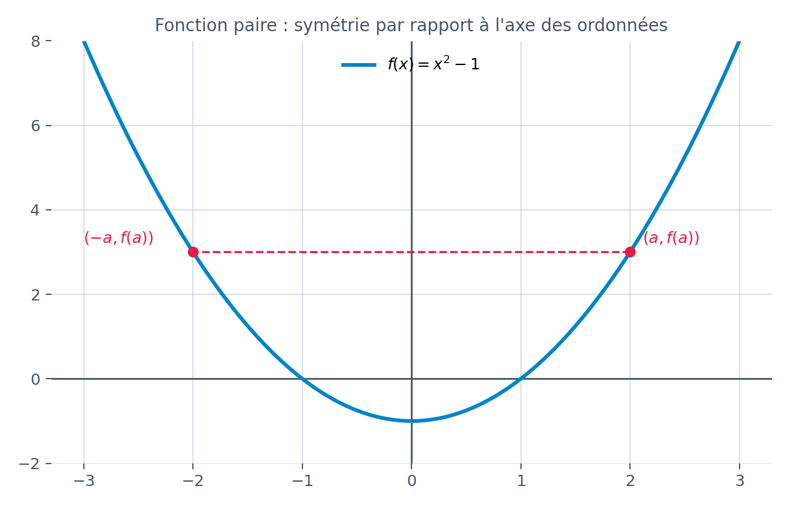
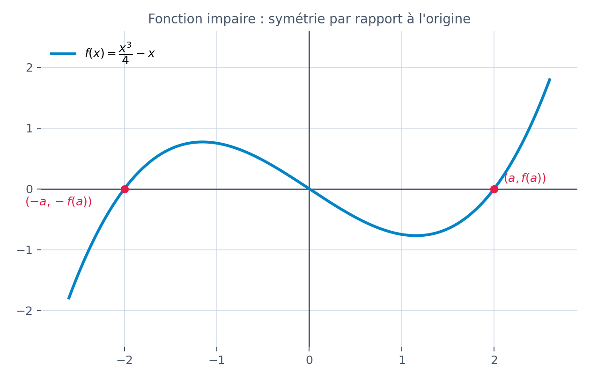
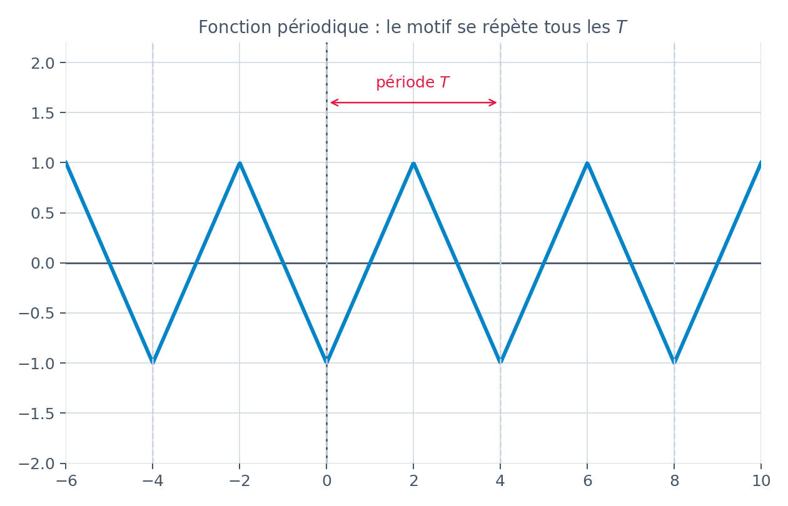
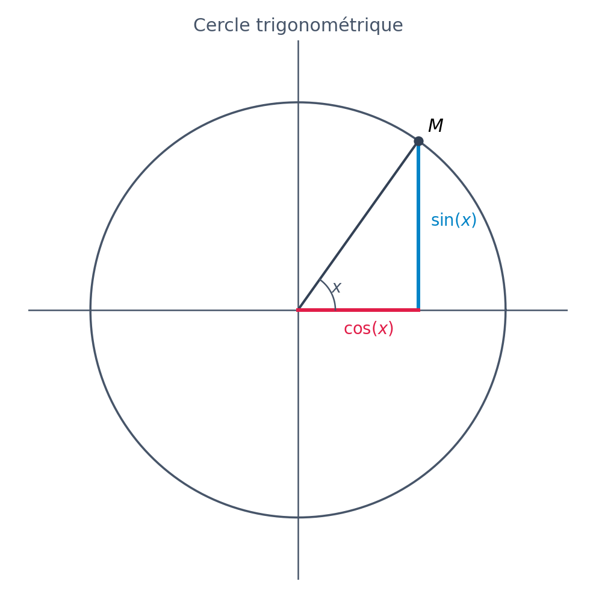
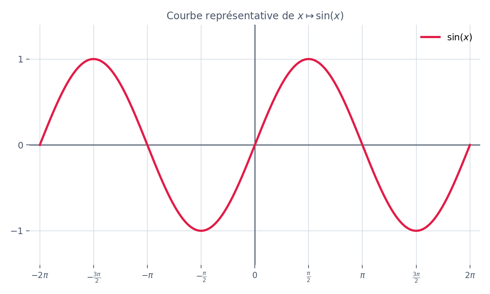
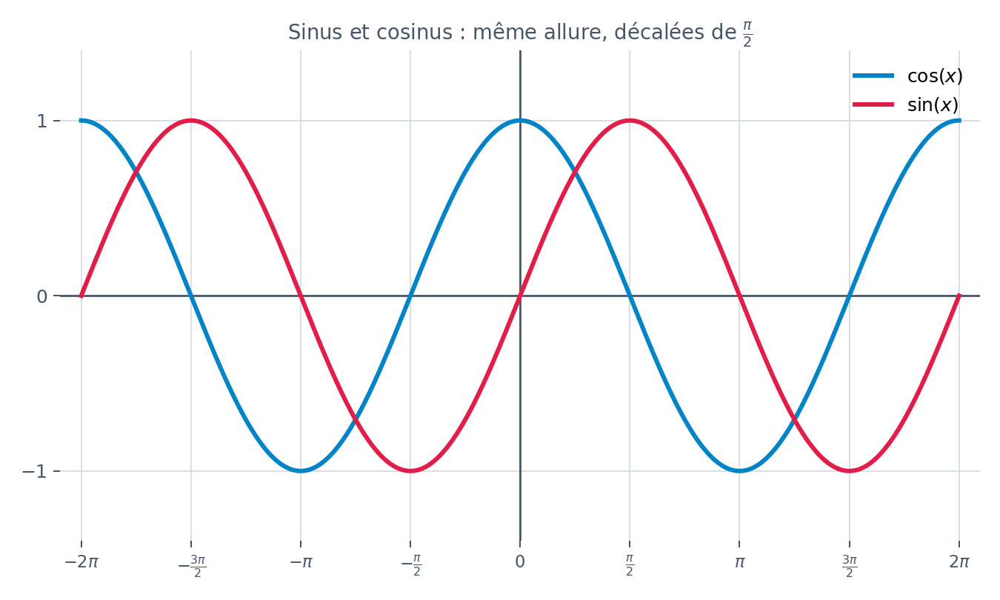
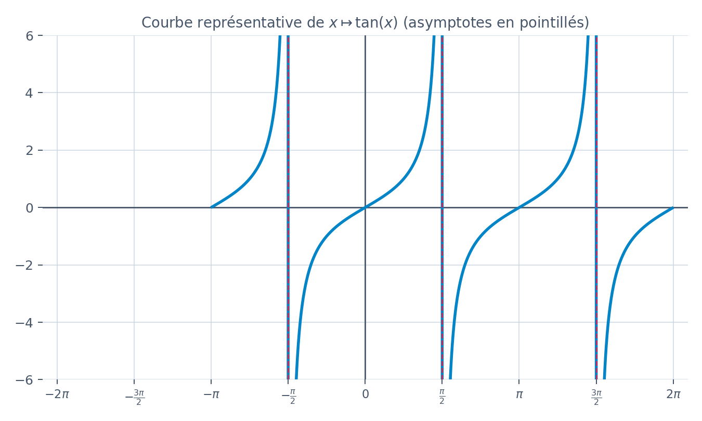

## 1. Parité et périodicité d'une fonction quelconque

Avant d'étudier sinus et cosinus, il faut connaître deux propriétés générales que peut avoir **n'importe quelle** fonction $f$. Elles serviront tout le temps ensuite.

### Fonction paire

$f$ est **paire** sur un ensemble $D$ symétrique par rapport à $0$ (c'est-à-dire que si $x \in D$ alors $-x \in D$) si :
$$
\text{pour tout } x \in D, \quad f(-x) = f(x)
$$

**Conséquence graphique :** la courbe de $f$ est **symétrique par rapport à l'axe des ordonnées** (l'axe $(Oy)$).

**Exemple :** $f(x) = x^2-1$ est paire, car $f(-x) = (-x)^2-1 = x^2-1 = f(x)$.

### Fonction impaire

$f$ est **impaire** sur un ensemble $D$ symétrique par rapport à $0$ si :
$$
\text{pour tout } x \in D, \quad f(-x) = -f(x)
$$

**Conséquence graphique :** la courbe de $f$ est **symétrique par rapport à l'origine** $O$.

**Exemple :** $f(x) = \dfrac{x^3}{4}-x$ est impaire, car $f(-x) = \dfrac{(-x)^3}{4}-(-x) = -\dfrac{x^3}{4}+x = -f(x)$.

> 💡 **Méthode pour étudier la parité :** on calcule $f(-x)$, on le simplifie, puis on compare avec $f(x)$ et $-f(x)$.
> - Si $f(-x)=f(x)$ → paire
> - Si $f(-x)=-f(x)$ → impaire
> - Sinon → ni paire, ni impaire (c'est le cas le plus fréquent !)

### Fonction périodique

$f$ est **périodique de période $T$** ($T>0$) si, pour tout $x$ du domaine de $f$ :
$$
f(x+T) = f(x)
$$

Cela signifie que la courbe se **répète identique à elle-même** tous les $T$ en abscisse : on connaît toute la fonction dès qu'on la connaît sur un intervalle de longueur $T$.

**Exemple :** les aiguilles d'une horloge, un signal sonore régulier, ou encore... sinus et cosinus, comme on va le voir juste en dessous !

---

## 2. Les fonctions sinus et cosinus

### Définition à partir du cercle trigonométrique

On munit le plan d'un cercle de centre $O$ et de rayon $1$ (le **cercle trigonométrique**). Pour tout réel $x$, on place le point $M$ obtenu en parcourant une longueur $x$ sur le cercle à partir du point $(1;0)$, dans le sens direct (sens inverse des aiguilles d'une montre) si $x>0$.

- $\cos(x)$ est l'**abscisse** du point $M$
- $\sin(x)$ est l'**ordonnée** du point $M$

### Courbes représentatives

On voit bien sur le graphique suivant que les deux courbes ont exactement la même forme, simplement décalée horizontalement de $\dfrac{\pi}{2}$ :

### Tableau récapitulatif des propriétés

<table style={{width: "100%", borderCollapse: "collapse", margin: "20px 0", fontSize: "15px"}}>
  <thead>
    <tr style={{borderBottom: "2px solid rgba(56,189,248,0.4)"}}>
      <th style={{textAlign: "left", padding: "10px 12px", opacity: 0.75, fontWeight: 600}}>Propriété</th>
      <th style={{textAlign: "left", padding: "10px 12px", opacity: 0.75, fontWeight: 600}}>$\cos$</th>
      <th style={{textAlign: "left", padding: "10px 12px", opacity: 0.75, fontWeight: 600}}>$\sin$</th>
    </tr>
  </thead>
  <tbody>
    <tr style={{borderBottom: "1px solid rgba(0,0,0,0.08)"}}>
      <td style={{padding: "10px 12px"}}>Ensemble de définition</td>
      <td style={{padding: "10px 12px"}}>$\mathbb{R}$</td>
      <td style={{padding: "10px 12px"}}>$\mathbb{R}$</td>
    </tr>
    <tr style={{borderBottom: "1px solid rgba(0,0,0,0.08)", background: "rgba(56,189,248,0.04)"}}>
      <td style={{padding: "10px 12px"}}>Valeurs prises</td>
      <td style={{padding: "10px 12px"}}>$[-1,1]$</td>
      <td style={{padding: "10px 12px"}}>$[-1,1]$</td>
    </tr>
    <tr style={{borderBottom: "1px solid rgba(0,0,0,0.08)"}}>
      <td style={{padding: "10px 12px"}}>Parité</td>
      <td style={{padding: "10px 12px"}}><strong>paire</strong> : $\cos(-x)=\cos(x)$</td>
      <td style={{padding: "10px 12px"}}><strong>impaire</strong> : $\sin(-x)=-\sin(x)$</td>
    </tr>
    <tr style={{borderBottom: "1px solid rgba(0,0,0,0.08)", background: "rgba(56,189,248,0.04)"}}>
      <td style={{padding: "10px 12px"}}>Périodicité</td>
      <td style={{padding: "10px 12px"}}>$2\pi$-périodique</td>
      <td style={{padding: "10px 12px"}}>$2\pi$-périodique</td>
    </tr>
    <tr style={{borderBottom: "1px solid rgba(0,0,0,0.08)"}}>
      <td style={{padding: "10px 12px"}}>Symétrie de la courbe</td>
      <td style={{padding: "10px 12px"}}>axe des ordonnées</td>
      <td style={{padding: "10px 12px"}}>origine $O$</td>
    </tr>
    <tr style={{background: "rgba(56,189,248,0.04)"}}>
      <td style={{padding: "10px 12px"}}>Dérivée</td>
      <td style={{padding: "10px 12px"}}>$\cos'(x) = -\sin(x)$</td>
      <td style={{padding: "10px 12px"}}>$\sin'(x) = \cos(x)$</td>
    </tr>
  </tbody>
</table>

### Valeurs remarquables à connaître par cœur

<table style={{width: "100%", borderCollapse: "collapse", margin: "20px 0", fontSize: "15px"}}>
  <thead>
    <tr style={{borderBottom: "2px solid rgba(251,113,133,0.4)"}}>
      <th style={{textAlign: "left", padding: "10px 12px", opacity: 0.75, fontWeight: 600}}>$x$</th>
      <th style={{textAlign: "center", padding: "10px 12px", opacity: 0.75, fontWeight: 600}}>$0$</th>
      <th style={{textAlign: "center", padding: "10px 12px", opacity: 0.75, fontWeight: 600}}>$\dfrac{\pi}{6}$</th>
      <th style={{textAlign: "center", padding: "10px 12px", opacity: 0.75, fontWeight: 600}}>$\dfrac{\pi}{4}$</th>
      <th style={{textAlign: "center", padding: "10px 12px", opacity: 0.75, fontWeight: 600}}>$\dfrac{\pi}{3}$</th>
      <th style={{textAlign: "center", padding: "10px 12px", opacity: 0.75, fontWeight: 600}}>$\dfrac{\pi}{2}$</th>
    </tr>
  </thead>
  <tbody>
    <tr style={{borderBottom: "1px solid rgba(0,0,0,0.08)"}}>
      <td style={{padding: "10px 12px"}}>$\cos(x)$</td>
      <td style={{padding: "10px 12px", textAlign: "center"}}>$1$</td>
      <td style={{padding: "10px 12px", textAlign: "center"}}>$\dfrac{\sqrt{3}}{2}$</td>
      <td style={{padding: "10px 12px", textAlign: "center"}}>$\dfrac{\sqrt{2}}{2}$</td>
      <td style={{padding: "10px 12px", textAlign: "center"}}>$\dfrac{1}{2}$</td>
      <td style={{padding: "10px 12px", textAlign: "center"}}>$0$</td>
    </tr>
    <tr style={{background: "rgba(251,113,133,0.04)"}}>
      <td style={{padding: "10px 12px"}}>$\sin(x)$</td>
      <td style={{padding: "10px 12px", textAlign: "center"}}>$0$</td>
      <td style={{padding: "10px 12px", textAlign: "center"}}>$\dfrac{1}{2}$</td>
      <td style={{padding: "10px 12px", textAlign: "center"}}>$\dfrac{\sqrt{2}}{2}$</td>
      <td style={{padding: "10px 12px", textAlign: "center"}}>$\dfrac{\sqrt{3}}{2}$</td>
      <td style={{padding: "10px 12px", textAlign: "center"}}>$1$</td>
    </tr>
  </tbody>
</table>

> 💡 **Astuce pour retenir ce tableau :** les valeurs de $\sin$ et $\cos$ sont symétriques l'une de l'autre en lisant la ligne dans l'autre sens : $\cos\!\left(\dfrac{\pi}{6}\right) = \sin\!\left(\dfrac{\pi}{3}\right)$, etc. C'est normal, car $\cos(x) = \sin\!\left(\dfrac{\pi}{2}-x\right)$.

### Formule fondamentale

Pour tout réel $x$ :
$$
\cos^2(x) + \sin^2(x) = 1
$$

C'est simplement le théorème de Pythagore appliqué dans le cercle trigonométrique (rayon $1$) !

### Dérivées : à retenir

$$
(\cos)' = -\sin \qquad\qquad (\sin)' = \cos
$$

**Exemple :** soit $g(x) = 3\cos(x) - 2\sin(x)$. Alors $g'(x) = -3\sin(x) - 2\cos(x)$.

**Exemple (fonction composée avec $u$) :** si $h(x) = \cos(2x+1)$, on pose $u(x)=2x+1$ donc $u'(x)=2$, et on utilise $(\cos(u))' = -u'\sin(u)$ :
$$
h'(x) = -2\sin(2x+1)
$$

---

## 3. La fonction tangente

Pour $x \neq \dfrac{\pi}{2} + k\pi$ ($k \in \mathbb{Z}$), on définit :
$$
\tan(x) = \frac{\sin(x)}{\cos(x)}
$$

<table style={{width: "100%", borderCollapse: "collapse", margin: "20px 0", fontSize: "15px"}}>
  <thead>
    <tr style={{borderBottom: "2px solid rgba(56,189,248,0.4)"}}>
      <th style={{textAlign: "left", padding: "10px 12px", opacity: 0.75, fontWeight: 600}}>Propriété</th>
      <th style={{textAlign: "left", padding: "10px 12px", opacity: 0.75, fontWeight: 600}}>$\tan$</th>
    </tr>
  </thead>
  <tbody>
    <tr style={{borderBottom: "1px solid rgba(0,0,0,0.08)"}}>
      <td style={{padding: "10px 12px"}}>Ensemble de définition</td>
      <td style={{padding: "10px 12px"}}>$\mathbb{R} \setminus \left\{\dfrac{\pi}{2}+k\pi,\ k \in \mathbb{Z}\right\}$</td>
    </tr>
    <tr style={{borderBottom: "1px solid rgba(0,0,0,0.08)", background: "rgba(56,189,248,0.04)"}}>
      <td style={{padding: "10px 12px"}}>Parité</td>
      <td style={{padding: "10px 12px"}}><strong>impaire</strong> : $\tan(-x) = -\tan(x)$</td>
    </tr>
    <tr style={{borderBottom: "1px solid rgba(0,0,0,0.08)"}}>
      <td style={{padding: "10px 12px"}}>Périodicité</td>
      <td style={{padding: "10px 12px"}}>$\pi$-périodique (pas $2\pi$ !)</td>
    </tr>
    <tr style={{background: "rgba(56,189,248,0.04)"}}>
      <td style={{padding: "10px 12px"}}>Dérivée</td>
      <td style={{padding: "10px 12px"}}>$\tan'(x) = 1+\tan^2(x) = \dfrac{1}{\cos^2(x)}$</td>
    </tr>
  </tbody>
</table>

**Exemple :** $\tan(0)=0$, $\tan\!\left(\dfrac{\pi}{4}\right)=1$, $\tan\!\left(\dfrac{\pi}{3}\right)=\sqrt{3}$.

---

## 4. Tableau récapitulatif final

<table style={{width: "100%", borderCollapse: "collapse", margin: "20px 0", fontSize: "15px"}}>
  <thead>
    <tr style={{borderBottom: "2px solid rgba(251,113,133,0.4)"}}>
      <th style={{textAlign: "left", padding: "10px 12px", opacity: 0.75, fontWeight: 600}}></th>
      <th style={{textAlign: "left", padding: "10px 12px", opacity: 0.75, fontWeight: 600}}>$\cos(x)$</th>
      <th style={{textAlign: "left", padding: "10px 12px", opacity: 0.75, fontWeight: 600}}>$\sin(x)$</th>
      <th style={{textAlign: "left", padding: "10px 12px", opacity: 0.75, fontWeight: 600}}>$\tan(x)$</th>
    </tr>
  </thead>
  <tbody>
    <tr style={{borderBottom: "1px solid rgba(0,0,0,0.08)"}}>
      <td style={{padding: "10px 12px"}}>Parité</td>
      <td style={{padding: "10px 12px"}}>paire</td>
      <td style={{padding: "10px 12px"}}>impaire</td>
      <td style={{padding: "10px 12px"}}>impaire</td>
    </tr>
    <tr style={{borderBottom: "1px solid rgba(0,0,0,0.08)", background: "rgba(251,113,133,0.04)"}}>
      <td style={{padding: "10px 12px"}}>Période</td>
      <td style={{padding: "10px 12px"}}>$2\pi$</td>
      <td style={{padding: "10px 12px"}}>$2\pi$</td>
      <td style={{padding: "10px 12px"}}>$\pi$</td>
    </tr>
    <tr>
      <td style={{padding: "10px 12px"}}>Dérivée</td>
      <td style={{padding: "10px 12px"}}>$-\sin(x)$</td>
      <td style={{padding: "10px 12px"}}>$\cos(x)$</td>
      <td style={{padding: "10px 12px"}}>$1+\tan^2(x)$</td>
    </tr>
  </tbody>
</table>

---

### Formules de symétrie utiles (angles associés)

<table style={{width: "100%", borderCollapse: "collapse", margin: "20px 0", fontSize: "15px"}}>
  <tbody>
    <tr style={{borderBottom: "1px solid rgba(0,0,0,0.08)"}}>
      <td style={{padding: "8px 10px", fontWeight: 600}}>$-x$</td>
      <td style={{padding: "8px 10px"}}>$\cos(-x)=\cos(x)$</td>
      <td style={{padding: "8px 10px"}}>$\sin(-x)=-\sin(x)$</td>
    </tr>
    <tr style={{borderBottom: "1px solid rgba(0,0,0,0.08)", background: "rgba(251,113,133,0.04)"}}>
      <td style={{padding: "8px 10px", fontWeight: 600}}>$\pi - x$</td>
      <td style={{padding: "8px 10px"}}>$\cos(\pi-x)=-\cos(x)$</td>
      <td style={{padding: "8px 10px"}}>$\sin(\pi-x)=\sin(x)$</td>
    </tr>
    <tr style={{borderBottom: "1px solid rgba(0,0,0,0.08)"}}>
      <td style={{padding: "8px 10px", fontWeight: 600}}>$\pi + x$</td>
      <td style={{padding: "8px 10px"}}>$\cos(\pi+x)=-\cos(x)$</td>
      <td style={{padding: "8px 10px"}}>$\sin(\pi+x)=-\sin(x)$</td>
    </tr>
    <tr>
      <td style={{padding: "8px 10px", fontWeight: 600}}>$\dfrac{\pi}{2} - x$</td>
      <td style={{padding: "8px 10px"}}>$\cos\!\left(\dfrac{\pi}{2}-x\right)=\sin(x)$</td>
      <td style={{padding: "8px 10px"}}>$\sin\!\left(\dfrac{\pi}{2}-x\right)=\cos(x)$</td>
    </tr>
  </tbody>
</table>

---

## À retenir

- **Paire** : $f(-x)=f(x)$, courbe symétrique par rapport à $(Oy)$. **Impaire** : $f(-x)=-f(x)$, courbe symétrique par rapport à $O$.
- **Périodique de période $T$** : $f(x+T)=f(x)$, le motif se répète.
- $\cos$ est **paire**, $\sin$ est **impaire**, toutes deux **$2\pi$-périodiques**.
- $\cos^2(x)+\sin^2(x)=1$.
- $\cos'=-\sin$ et $\sin'=\cos$ — à savoir par cœur, elles servent tout le temps.
- $\tan(x) = \dfrac{\sin(x)}{\cos(x)}$, impaire, **$\pi$-périodique**, de dérivée $1+\tan^2(x)$.